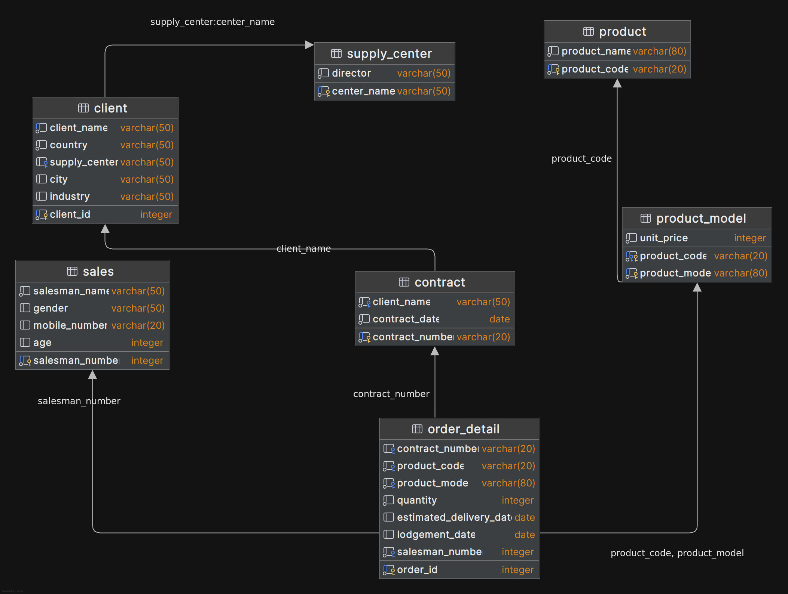
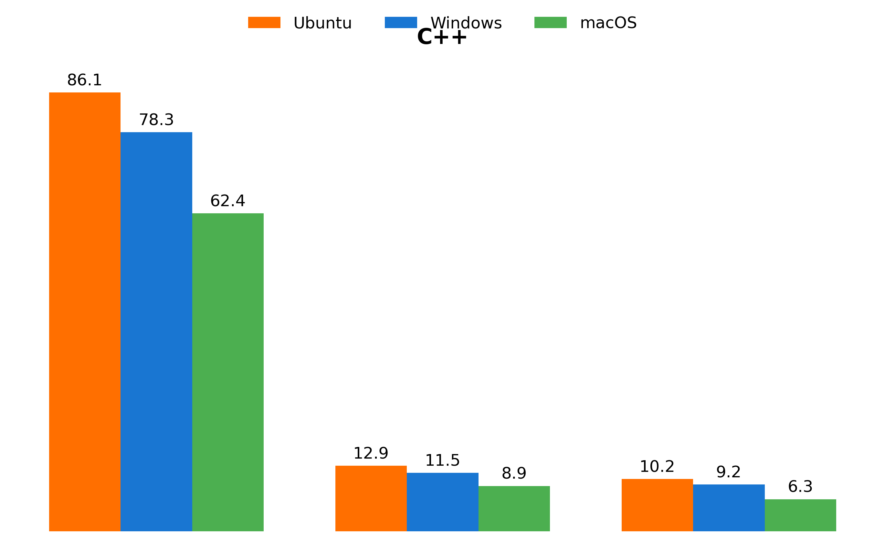
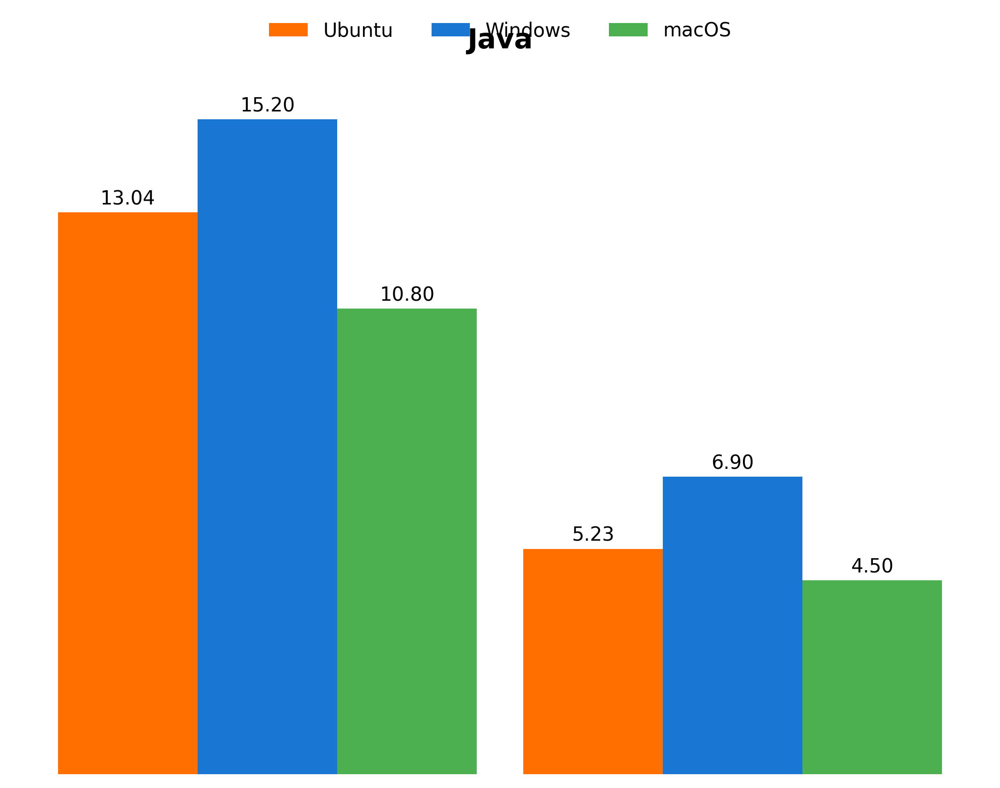
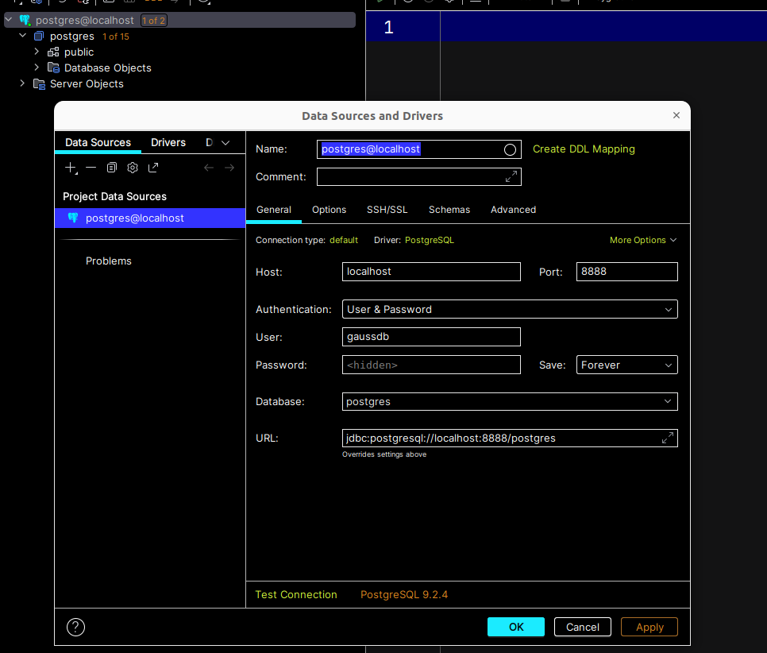
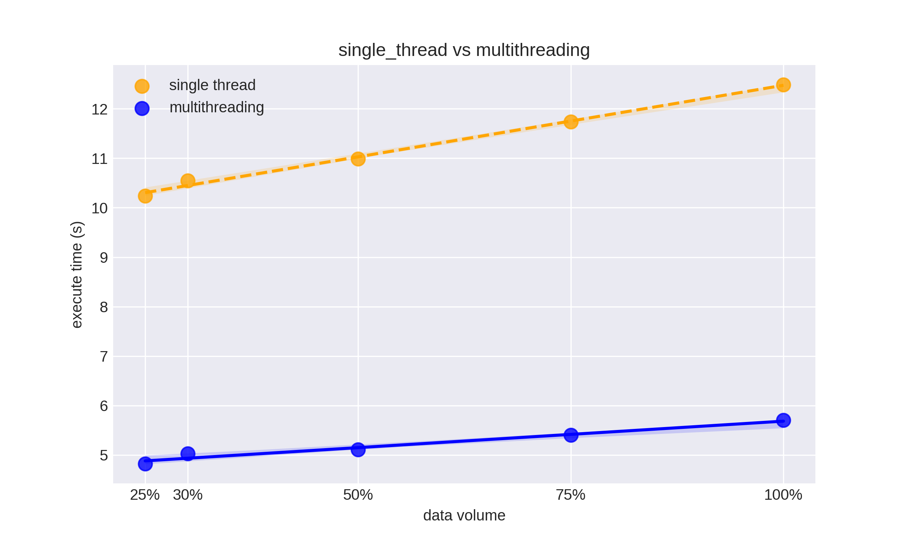

# Spring 2025 CS307 Project1

## OurTeam

|                 魏国新 SID 12312030                 |                    姚圣淇 SID 12411126                     |
| :-------------------------------------------------: | :--------------------------------------------------------: |
| Task: Python script C++ script write paper | Task: Design E-R Diagram  Java script write paper |
|           Percentage of contribution: 50%           |              Percentage of contribution: 50%               |

## E-R diagram

- The E-R diagram is drawn on the processon

## Database Design

(create table statements file is in `/create_table.sql`)

### Content Description

### **1. supply_center**
- **Purpose**: Stores information about supply centers.
- **Columns**:
    - `center_name` (Primary Key): Unique name of the supply center.
    - `director`: Name of the director managing the center.
### **2. `client`**
- **Purpose**: Stores client details and their associated supply centers.
- **Columns**:
    - `client_id` (PK): Auto-incremented unique identifier for the client.
    - `client_name`: Unique name of the client.
    - `country`, `city`, `industry`: Geographic and business details of the client.
    - `supply_center` (Foreign Key): Links the client to their assigned supply center, which is defined by clients country.
### **3. `contract`**
- **Purpose**: Stores contracts basic info.
- **Columns**:
    - `contract_number` (PK): Unique identifier for the contract.
    - `client_name` (Foreign Key): References the client who signed the contract.
    - `contract_date`: Date when the contract was signed.
### **4. `sales`**
- **Purpose**: Stores salesman details.
- **Columns**:
    - `salesman_number` (PK): Unique identifier for the salesman.
    - `salesman_name`: Name of the salesperson.
    - `gender`, `age`, `mobile_number`: Basic information of the salesman.
### **5. `product`**
- **Purpose**: Stores basic product information.
- **Columns**:
    - `product_code` (PK): Unique code for the product.
    - `product_name`: Descriptive name of the product.
### **6. `product_model`**
- **Purpose**: Stores specific models of a product and their unit price.
- **Columns**:
    - `product_code` (PK/FK): Links to the parent product (`product.product_code`).
    - `product_model` (PK): Name of the model (e.g., "Pro Max 256GB").
    - `unit_price`: Price per unit for the model.
### **7. `order_detail`**

- **Purpose**: Captures detailed information about individual orders.
- **Columns**:
    - `order_id` (PK): Auto-incremented unique identifier for the order.
    - `contract_number` (FK): Links the order to its parent contract.
    - `product_code` + `product_model` (Composite FK): Specifies the product model ordered.
    - `quantity`: Number of units ordered.
    - `estimated_delivery_date`: Planned delivery date.
    - `lodgement_date`: Actual delivery date.
    - `salesman_number` (FK): Salesperson responsible for the order.

## Data Import

### Java

in `src/javaImplementation`

| Script name               | Author      | Description                                  |
| ------------------------- | ----------- | -------------------------------------------- |
| /Java/Load.java           | Yao Shengqi | The main function. Run this with parameters  |
| /Java/LowLoad.java        | Yao Shengqi | The class that imports the data in serial    |
| /Java/ConcurrentLoad.java | Yao Shengqi | The class that imports the data concurrently |
| /Java/PrepareTool.java    | Yao Shengqi | The class that provides preparing method     |

#### How to use

1. Import all the .jar file in `/dependencies`. Notice the postgresql dependency is not included.
2. Use `create_table.sql` to create table.
3. Modify the `resources/dbUser.properties`. Edit the 'database', 'user', 'pwd', 'port'
4. Move the original (or modified) .csv file under path `/resources`. Rename the file `output25S.csv`
5. Open `/src/Java/Load.java`, run with parameters:
	1. `0` concurrent mode
	2. `1` serial mode

### Python

in `src/Python`

| Script name        | Author     | Description                          |
| ------------------ | ---------- | ------------------------------------ |
| load_single.py     | Wei Guoxin | Import data by insert them in turn   |
| load_parallel.py   | Wei Guoxin | A parallel version of the above code |
| load_imp_single.py | Wei Guoxin | Optimized version of import data     |
| load_imp_par.py    | Wei Guoxin | A parallel version of the above code |

#### How to use

1. Use conda to create a environment `database`
2. Use pip to get psycopg2 and pandas
3. run the selected script

### C++

in `src/C++`

| Script name       | Author     | Description                          |
| ----------------- | ---------- | ------------------------------------ |
| load_single.cpp   | Wei Guoxin | Import data by insert them in turn   |
| load_parallel.cpp | Wei Guoxin | A parallel version of the above code |
| load_imp_sin.cpp  | Wei Guoxin | Optimized version of import data     |
| load_imp_par.cpp  | Wei Guoxin | A parallel version of the above code |

#### How to use

1. Read `env.txt` and configure the environment
2. use cmake and make to create executable file
3. run the code to import data

## Advanced

### Optimization

#### Java

- In concurrent mode, the script first parses the data and stores it into a list. It then imports the data in three concurrent batches based on parent-child table relationships. Each batch is mutually independent, allowing concurrent imports. Lower-level data depends on the completion of higher-level data. The third batch exclusively imports the ​order_details​ table by splitting the list into multiple sub-batches for multi-threaded import.

#### Python

- **Batch insertion** is achieved through **`execute_batch`** and **temporary tables**, combining multiple records into a single batch to reduce database interaction overhead.
- When reading the CSV file, the `dtype` parameter is used  to explicitly specify column types (e.g., strings, numeric values),  avoiding the performance cost of Pandas' automatic type inference.
- **Thread pool technology** is employed for parallel optimization, significantly improving code execution speed.

#### C++

- Uses `std::async` and `std::future` to implement multi-threaded parallel insertion of data into different tables
- Uses `pqxx::stream_to` for batch streaming insertion  instead of executing SQL statements row by row, reducing database round  trips and significantly improving insertion efficiency
- Uses pass-by-reference to avoid data copying (`std::ref`)

### Compared different scripts in different system

|        |                  | Ubuntu 22.04 | Windows 11 | macOS |
| ------ | ---------------- | ------------ | ---------- | ----- |
| Java   | single-thread    | 13.037       | 15.2       | 10.8  |
|        | multithreading   | 5.231        | 6.9        | 4.5   |
| Python | original version | 126.0        | 138.0      | 115.0 |
|        | single-thread    | 26.63        | 28.5       | 24.2  |
|        | multithreading   | 22.97        | 29.8       | 23.5  |
| C++    | original version | 86.1         | 78.3       | 62.4  |
|        | single-thread    | 12.87        | 11.5       | 8.9   |
|        | multithreading   | 10.24        | 9.2        | 6.3   |

### other databases

#### Mysql

#### OpenGauss

### import data with different data volumes

| data volume | single-thread time(s) | multithreading time(s) |
| :---------: | :-------------------: | :--------------------: |
|     25%     |         10.24         |          4.82          |
|     30%     |         10.55         |          5.03          |
|     50%     |         10.99         |          5.11          |
|     75%     |         11.74         |          5.40          |
|    100%     |         12.49         |          5.70          |

