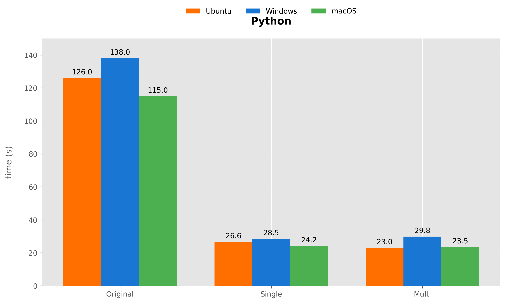

# Spring 2025 CS307 Project1

## OurTeam

|                 魏国新 SID 12312030                 |                    姚圣淇 SID 12411126                     |
| :-------------------------------------------------: | :--------------------------------------------------------: |
| Task: Python script C++ script write paper | Task: Design E-R Diagram  Java script write paper |
|           Percentage of contribution: 50%           |              Percentage of contribution: 50%               |

## E-R diagram

- The E-R diagram is drawn on the processon

## Database Design

(create table statements file is in `/create_table.sql`)

### Content Description

### **1. supply_center**
- **Purpose**: Stores information about supply centers.
- **Columns**:
    - `center_name` (Primary Key): Unique name of the supply center.
    - `director`: Name of the director managing the center.
### **2. `client`**
- **Purpose**: Stores client details and their associated supply centers.
- **Columns**:
    - `client_id` (PK): Auto-incremented unique identifier for the client.
    - `client_name`: Unique name of the client.
    - `country`, `city`, `industry`: Geographic and business details of the client.
    - `supply_center` (Foreign Key): Links the client to their assigned supply center, which is defined by clients country.
### **3. `contract`**
- **Purpose**: Stores contracts basic info.
- **Columns**:
    - `contract_number` (PK): Unique identifier for the contract.
    - `client_name` (Foreign Key): References the client who signed the contract.
    - `contract_date`: Date when the contract was signed.
### **4. `sales`**
- **Purpose**: Stores salesman details.
- **Columns**:
    - `salesman_number` (PK): Unique identifier for the salesman.
    - `salesman_name`: Name of the salesperson.
    - `gender`, `age`, `mobile_number`: Basic information of the salesman.
### **5. `product`**
- **Purpose**: Stores basic product information.
- **Columns**:
    - `product_code` (PK): Unique code for the product.
    - `product_name`: Descriptive name of the product.
### **6. `product_model`**
- **Purpose**: Stores specific models of a product and their unit price.
- **Columns**:
    - `product_code` (PK/FK): Links to the parent product (`product.product_code`).
    - `product_model` (PK): Name of the model (e.g., "Pro Max 256GB").
    - `unit_price`: Price per unit for the model.
### **7. `order_detail`**

- **Purpose**: Captures detailed information about individual orders.
- **Columns**:
    - `order_id` (PK): Auto-incremented unique identifier for the order.
    - `contract_number` (FK): Links the order to its parent contract.
    - `product_code` + `product_model` (Composite FK): Specifies the product model ordered.
    - `quantity`: Number of units ordered.
    - `estimated_delivery_date`: Planned delivery date.
    - `lodgement_date`: Actual delivery date.
    - `salesman_number` (FK): Salesperson responsible for the order.

## Data Import

### Java

in `src/javaImplementation`

| Script name               | Author      | Description                                  |
| ------------------------- | ----------- | -------------------------------------------- |
| /Java/Load.java           | Yao Shengqi | The main function. Run this with parameters  |
| /Java/LowLoad.java        | Yao Shengqi | The class that imports the data in serial    |
| /Java/ConcurrentLoad.java | Yao Shengqi | The class that imports the data concurrently |
| /Java/PrepareTool.java    | Yao Shengqi | The class that provides preparing method     |

#### How to use

1. Import all the .jar file in `/dependencies`. Notice the postgresql dependency is not included.
2. Use `create_table.sql` to create table.
3. Modify the `resources/dbUser.properties`. Edit the 'database', 'user', 'pwd', 'port'
4. Move the original (or modified) .csv file under path `/resources`. Rename the file `output25S.csv`
5. Open `/src/Java/Load.java`, run with parameters:
	1. `0` concurrent mode
	2. `1` serial mode

### Python

in `src/Python`

| Script name        | Author     | Description                          |
| ------------------ | ---------- | ------------------------------------ |
| load_single.py     | Wei Guoxin | Import data by insert them in turn   |
| load_parallel.py   | Wei Guoxin | A parallel version of the above code |
| load_imp_single.py | Wei Guoxin | Optimized version of import data     |
| load_imp_par.py    | Wei Guoxin | A parallel version of the above code |

#### How to use

1. Use conda to create a environment `database`
2. Use pip to get psycopg2 and pandas
3. run the selected script

### C++

in `src/C++`

| Script name       | Author     | Description                          |
| ----------------- | ---------- | ------------------------------------ |
| load_single.cpp   | Wei Guoxin | Import data by insert them in turn   |
| load_parallel.cpp | Wei Guoxin | A parallel version of the above code |
| load_imp_sin.cpp  | Wei Guoxin | Optimized version of import data     |
| load_imp_par.cpp  | Wei Guoxin | A parallel version of the above code |

#### How to use

1.  Begin by reading the `env.txt` file, which contains critical environment variables and settings required for the project.
2. Utilize `cmake` to generate build files tailored for your specific system and compiler. 
3. use `make` to compile the source code into an executable file
4. Once the executable is built, run the program to initiate the data import process. 

## Advanced

### Optimization

#### Java

- **Data Parsing and Storing**: Initially, the script parses the input data and stores it into a list structure. This list serves as a temporary repository that holds the data before it is imported into the database.
- **Concurrent Batch Imports**: The data is then imported in three separate concurrent batches. This approach is based on the parent-child relationships between different tables within the database.
- **Order Details Import**: The third batch is dedicated exclusively to importing the `order_details` table. This is a critical step because the `order_details` table often contains a large volume of data that needs to be processed.
- **Sub-Batching for Multi-Threaded Import**: To further enhance the efficiency of the import process, the list containing `order_details` data is split into multiple sub-batches. These sub-batches are then imported concurrently using multi-threading, which helps to distribute the workload and reduce the total import time.

#### Python

- **Batch insertion** is achieved through **`execute_batch`** and **temporary tables**, combining multiple records into a single batch to reduce database interaction overhead.
- When reading the CSV file, the `dtype` parameter is used  to explicitly specify column types (e.g., strings, numeric values),  avoiding the performance cost of Pandas' automatic type inference.
- **Thread pool technology** is employed for parallel optimization, significantly improving code execution speed.

#### C++

- **Multi-threaded Parallel Insertion**: The script utilizes `std::async` and `std::future` to implement multi-threaded operations. This allows concurrent data insertion into different tables, significantly enhancing the overall data import speed by leveraging the processing power of multiple CPU cores.
- **Batch Streaming Insertion**: Instead of executing individual SQL statements for each row, the script employs `pqxx::stream_to` for batch streaming insertion. This method reduces the number of database round trips, thus improving insertion efficiency and minimizing the load on the database server.
- **Avoiding Data Copying**: To further optimize performance, the script uses pass-by-reference with `std::ref` to avoid unnecessary data copying. This technique helps in reducing memory usage and improves the speed of data transfer between the application and the database.

### Compared different scripts in different system

|        |                  | Ubuntu 22.04 | Windows 11 | macOS |
| ------ | ---------------- | ------------ | ---------- | ----- |
| Java   | single-thread    | 13.037       | 15.2       | 10.8  |
|        | multithreading   | 5.231        | 6.9        | 4.5   |
| Python | original version | 126.0        | 138.0      | 115.0 |
|        | single-thread    | 26.63        | 28.5       | 24.2  |
|        | multithreading   | 22.97        | 29.8       | 23.5  |
| C++    | original version | 86.1         | 78.3       | 62.4  |
|        | single-thread    | 12.87        | 11.5       | 8.9   |
|        | multithreading   | 10.24        | 9.2        | 6.3   |

​	Overall, the macOS system demonstrates good performance in data import  operations across different data scales, while the Ubuntu system  performs relatively poorly. The performance of the Windows system falls  between the two. This may be related to factors such as the system  architecture, memory management, and I/O performance of each operating  system.

​	The chart clearly shows that parallel processing mode significantly  outperforms single-thread mode on all operating systems. Among them,  macOS demonstrates the best performance in both modes, while Windows has the poorest performance in single-thread mode. The parallel processing  mode reduces the execution time by more than half, showing its  efficiency in handling large volumes of data.

​	These charts shows that in general, the Java scripts have the best  performance, followed by C++ and then Python. 

​	Multithreading can  significantly improve the execution speed of the scripts. For example,  in Ubuntu 22.04, the Java multithreading script runs about 2 times  faster than the single-threaded version; the C++ multithreading script  runs about 1.25 times faster than the single-threaded version.

​	The main cost of time is connect to the database which make the original scripts run slower than the imporved version.

### other databases

​	In this project, in addition to the originally required  PostgreSQL database, we also used the openGauss and MySQL database  systems. The purpose of this work is to explore the characteristics and  differences of different database systems in terms of data storage,  query performance, and data import. By implementing the project on  openGauss and MySQL, we gained a deeper understanding of these  databases' architectural features, SQL dialect differences. For instance, on openGauss, we  explore how to use docker to run the database which can help us use DBMS more conventiently in the future.

#### Mysql

​	When migrating to MySQL, the SQL syntax differences from PostgreSQL  require modifications to both the table creation scripts and data import logic:

#### **1. Database Schema Adjustments**

- **Data Types**:
  - Replace PostgreSQL’s `SERIAL` with MySQL’s `AUTO_INCREMENT`.
  - MySQL implements `BOOLEAN` as `TINYINT(1)`, unlike PostgreSQL’s native `BOOLEAN`.
- **Constraints & Indexes**:
  - MySQL lacks `EXCLUDE` constraints; use `UNIQUE` or application checks.
  - Foreign key actions (`ON DELETE/UPDATE`) must be explicitly defined.

#### **2. Data Import Logic Changes**

- **Bulk Insert Optimization**:
  - Replace PostgreSQL’s `COPY` with MySQL’s `LOAD DATA INFILE` or batched `INSERT`.
  - Use `INSERT IGNORE` or `ON DUPLICATE KEY UPDATE` instead of PostgreSQL’s `ON CONFLICT DO NOTHING`.
- **Connection & Transactions**:
  - MySQL defaults to `REPEATABLE READ` isolation (vs. PostgreSQL’s `READ COMMITTED`).

#### OpenGauss

​	During the process of using the openGauss database, we found that due to the use of Docker containerization deployment, port mapping is required to enable database management tools like DataGrip to connect and operate the database. 

​	At the same time, although openGauss is a database developed by Huawei based on PostgreSQL, and it is compatible with PostgreSQL in many aspects, there are still differences in some SQL syntax and usage habits. We need to modifying some incompatible SQL statements, adjusting database configuration parameters, and optimizing query performance.

​	Through this process, we have not only learned how to deploy and manage databases in a containerized environment but also deepened our understanding of the differences between different database systems. 

### import data with different data volumes

| data volume | single-thread time(s) | multithreading time(s) |
| :---------: | :-------------------: | :--------------------: |
|     25%     |         10.24         |          4.82          |
|     30%     |         10.55         |          5.03          |
|     50%     |         10.99         |          5.11          |
|     75%     |         11.74         |          5.40          |
|    100%     |         12.49         |          5.70          |

​	In general, multithreading demonstrates high efficiency in data  processing tasks. Particularly when dealing with large volumes of data,  the advantages of multithreading become more pronounced. Compared to  single-threading, multithreading can complete data processing tasks more quickly, thereby enhancing the system's throughput and response speed. 

​	Additionally, it has been observed that the import speed has an  approximately linear relationship with the data volume. This implies  that as the data volume increases, the import speed also increases  correspondingly, but at a relatively stable rate. 

 	In practical applications, we can choose between single-threading and  multithreading processing methods based on the amount of data to achieve optimal performance.

## Conclusion
​	In this project, we first established a relational database according to the data information stored in csv files, and then successfully imported the data into it. In the process of import, we further deepen our understanding and application of data import knowledge by comparing the efficiency differences between different import methods. In addition, we analyzed the data in different languages and compared different DBMS, which gave us an insight into different database management system. In the continuous experiment and comparison, our understanding of database index is also deepening.
